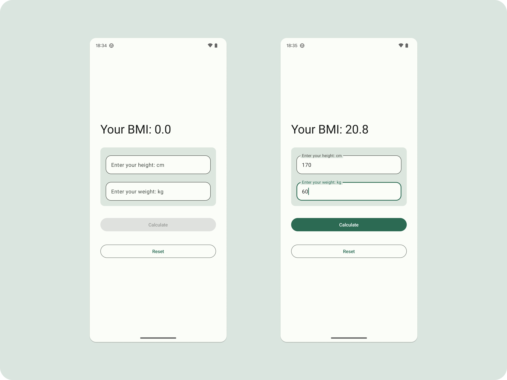

# BMI with Compose
This is a simple app learning how to use Jetpack Compose and ViewModel by MutableStateFlow.

## Screenshots

## Environment
- Android Studio Giraffe
- Android Gradle Plugin 8.1.3
- Kotlin 1.8.1
- JDK 8

## Reference
- [Jetpack Compose](https://developer.android.com/jetpack/compose)
- [ViewModel](https://developer.android.com/topic/libraries/architecture/viewmodel)
- [MutableStateFlow](https://developer.android.com/kotlin/flow/stateflow-and-sharedflow)
- [ViewModel and State in Compose](https://developer.android.com/codelabs/basic-android-kotlin-compose-viewmodel-and-state#0)